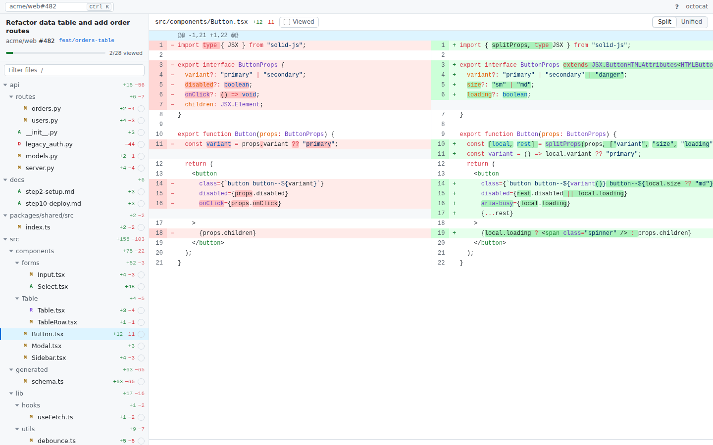

# Fast Reviewer

A fast desktop app for reviewing GitHub pull requests: a file tree on the left, a syntax-highlighted diff on the right, and one-key review (`r` marks the file viewed on GitHub and moves to the next one). It targets macOS first and is built on Tauri 2, so Linux is supported too.



## Features

- **PR picker** (`⌘K`): PRs waiting for your review and your own PRs. You can also fuzzy-search your repos and browse their open PRs, or paste a PR URL or `owner/repo#123`.
- **File tree**: folders first, then files, both alphabetical. Single-child folder chains are compacted (`src/lib/utils`). Each file shows its `+N −M` counts, status (A/M/D/R) and a viewed tick, and the header shows progress. Filter with `/`. GitHub lists at most 3,000 files per PR; for larger PRs the sidebar shows a "Showing N of M files" warning.
- **Diff**: split (side by side) or unified view. Changed lines are tinted, and the exact characters that changed inside a modified line get a stronger highlight. You can expand hidden context around hunks.
- **Syntax highlighting**: VS Code-quality highlighting (Shiki / TextMate grammars) for TypeScript, TSX, JavaScript, HTML, CSS, Python, JSON, Markdown, Rust, Go and more than 200 other languages. Highlighting runs in a Web Worker, so it never blocks scrolling. Grammars load on demand; when a PR opens, the grammars for its languages are loaded and warmed while the first diff is fetched.
- **GitHub sync**: "viewed" state is read from GitHub and written back in the background. It is the same checkbox as on github.com. If the write fails, the change is undone and a message is shown. If GitHub's GraphQL API is unavailable (some proxies and GHE setups), PRs load over REST instead; REST has no viewed state, so every file starts unviewed.
- **Speed**: the diffs of the next 3 unviewed files are fetched ahead of time, so `r` and `s` switch files in under 20 ms. Only visible rows are rendered, which keeps 5,000-line diffs smooth. Diffs are computed in Rust and cached in memory, and file contents are cached on disk by commit SHA.
- Light and dark mode follow the system setting.

## Keyboard shortcuts

| Key | Action |
|---|---|
| `r` | Mark file viewed (synced to GitHub in the background) and go to the next unviewed file |
| `s` | Skip to the next unviewed file without marking |
| `j` / `↓` | Next file |
| `k` / `↑` | Previous file |
| `u` | Toggle viewed on the current file |
| `v` | Toggle split / unified (remembered) |
| `n` / `p` | Next / previous hunk |
| `/` | Filter files |
| `o` | Open the PR in the browser |
| `⌘K` / `Ctrl+K` | Open a pull request |
| `?` | Show shortcuts |
| `Esc` | Close overlay / clear filter |

## Authentication

The app looks for a GitHub token in this order:

1. The `GH_TOKEN` or `GITHUB_TOKEN` environment variable
2. The GitHub CLI (`gh auth token`). If `gh` is installed and logged in, nothing else is needed.
3. A token pasted into the sign-in screen. It is checked against GitHub, then stored in the OS keychain under the service `fast-reviewer`.

If you paste a token, use either:
- a classic PAT with the `repo` scope, or
- a fine-grained PAT with **Pull requests: read & write** and **Contents: read**.

For GitHub Enterprise, set `GITHUB_API_URL` (for example `https://ghe.example.com/api/v3`).

## Download (CI builds)

Every push runs `.github/workflows/ci.yml`: lint and all tests on Linux, plus a universal macOS build (Apple Silicon + Intel).

- **Latest build:** open the repo's *Actions* tab → the latest *CI* run → download the `fast-reviewer-macos` artifact (`.dmg` and a zipped `.app`).
- **Releases:** push a tag like `v0.1.0` and CI publishes a GitHub Release with the `.dmg` attached.

When the Apple signing secrets below are set, CI signs the app with your Developer ID and notarizes it with Apple, so it opens normally. Without them, the build is only ad-hoc signed and macOS refuses to open the downloaded app.

### Code signing and notarization (one-time setup)

You need a paid Apple Developer Program membership.

1. **Create a Developer ID certificate.** On your Mac: Xcode → Settings → Accounts → select your team → *Manage Certificates…* → **+** → **Developer ID Application**. (Or create it at developer.apple.com → Certificates, using a CSR from Keychain Access.)
2. **Export it as .p12.** Keychain Access → *login* → *My Certificates* → right-click **Developer ID Application: Your Name (TEAMID)** → *Export…* → save as `cert.p12` with a strong password. Then copy it as base64:
   ```sh
   base64 -i cert.p12 | pbcopy
   ```
3. **Find the exact identity name:**
   ```sh
   security find-identity -v -p codesigning
   # → "Developer ID Application: Your Name (TEAMID1234)"
   ```
4. **Create an App Store Connect API key for notarization** (recommended): appstoreconnect.apple.com → *Users and Access* → *Integrations* → *App Store Connect API* → *Team Keys* → **+**, role **Developer**. Download `AuthKey_<KEYID>.p8` (only downloadable once) and note the **Key ID** and **Issuer ID**.
5. **Add repository secrets** (GitHub → repo → *Settings* → *Secrets and variables* → *Actions* → *New repository secret*):

   | Secret | Value |
   |---|---|
   | `APPLE_CERTIFICATE` | base64 of `cert.p12` (step 2) |
   | `APPLE_CERTIFICATE_PASSWORD` | the .p12 export password |
   | `APPLE_SIGNING_IDENTITY` | `Developer ID Application: Your Name (TEAMID1234)` (step 3) |
   | `APPLE_API_ISSUER` | Issuer ID (step 4) |
   | `APPLE_API_KEY` | Key ID (step 4) |
   | `APPLE_API_KEY_P8` | full contents of `AuthKey_<KEYID>.p8`, including the BEGIN/END lines |

   Alternative to the API key: `APPLE_ID` (your Apple ID email), `APPLE_PASSWORD` (an [app-specific password](https://account.apple.com) → Sign-In and Security → App-Specific Passwords) and `APPLE_TEAM_ID`.
6. **Re-run CI** (Actions → CI → *Run workflow*, or push). The macOS job signs, notarizes and staples both the `.app` and the `.dmg`, then fails the build if Gatekeeper (`spctl`) would reject them.

Delete `cert.p12` and the `.p8` from your disk once the secrets are saved.

## Development

Prerequisites: Rust (stable), Node 22+ and pnpm. On macOS you also need the Xcode command-line tools. On Linux you need the WebKitGTK 4.1 dev packages (see the [Tauri prerequisites](https://tauri.app/start/prerequisites/)).

```sh
pnpm install
pnpm tauri dev          # run the desktop app with hot reload
pnpm dev                # UI only in a browser at http://localhost:1420, using the mock backend
```

Build a release:

```sh
pnpm tauri build                 # macOS: target/release/bundle/macos/Fast Reviewer.app and bundle/dmg/*.dmg
pnpm tauri build --no-bundle     # just the binary: target/release/fast-reviewer
```

The mock backend is used automatically outside Tauri. It serves a 28-file fixture PR, a 2,400-file PR and a 3,000-line generated file. Flags: `?mock=unauth` starts signed out, `?mock=failviewed` makes viewed-sync fail, and `?mockViewedDelay=<ms>` makes viewed-sync take that long.

## Tests

```sh
cargo test --workspace                          # diff engine, GitHub client against a mock server, IPC contract
cargo clippy --workspace --all-targets -- -D warnings
pnpm typecheck
pnpm test                                       # Vitest unit tests
pnpm e2e                                        # Playwright end-to-end tests (mock backend)
cargo test --release -p fast_reviewer_core --test diff_perf -- --ignored --nocapture   # diff timings
GH_TOKEN=... cargo run -p fast_reviewer_core --example smoke -- <owner> <repo> <number> # read-only timing check against real GitHub
GH_TOKEN=... cargo run -p fast_reviewer_core --example compare_git -- <owner> <repo> <number> [<clone>]  # compare our diffs with `git diff`
```

`src/lib/contract.fixture.json` is shared by `crates/core/tests/contract.rs` and `src/lib/contract.test.ts`. This keeps the Rust serde output and the TypeScript types in `src/lib/types.ts` in sync.

## Architecture

See [docs/ARCHITECTURE.md](docs/ARCHITECTURE.md). The main pieces:
- `crates/core`: a Rust crate with no Tauri dependency. It handles GitHub, auth, diffing and caching.
- `src-tauri`: thin command wrappers around `crates/core`.
- `src/`: the UI, written in SolidJS + TypeScript. Shiki highlighting runs in `src/workers/`.
